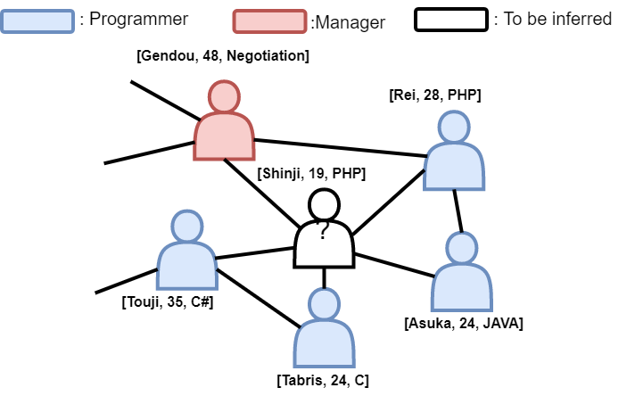
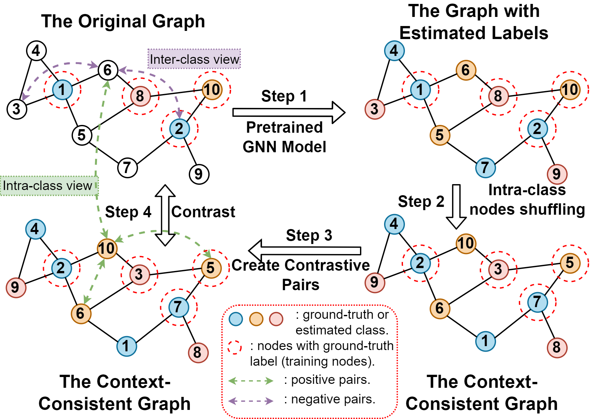

# CoCoS: Contrastive Context Sharing

<p align="center"></p>

This is the code repository of **AAAI 2022** paper 'CoCoS: Enhancing Semi-Supervised Learning on Graphs with Unlabeled 
Data via Contrastive Context Sharing'.
CoCos is an enhancement technique for GNN-based models.
It aims to improve GNN's representation capacity and performance when labeled nodes are scarce in a given dataset.
The main task is for node classifications.
The information of the corresponding paper is as follows:

> Title: CoCoS: Enhancing Semi-Supervised Learning on Graphs with Unlabeled Data via Contrastive Context Sharing

> Authors: Siyue Xie, Da Sun Handason Tam and Wing Cheong Lau

> Affiliation: The Chinese University of Hong Kong

> Abstract:  Graph Neural Networks (GNNs) have recently become a popular framework for semi-supervised learning on graph-structured data. 
>However, typical GNN models heavily rely on labeled data in the learning process, while ignoring or paying little attention to the data that are unlabeled but available. 
>To make full use of available data, we propose a generic framework, **Co**ntrastive **Co**ntext **S**haring (CoCoS), to enhance the learning capacity of GNNs for semi-supervised tasks. 
>By sharing the contextual information among nodes estimated to be in the same class, different nodes can be correlated even if they are unlabeled and remote from each other in the graph. 
>Models can therefore learn different combinations of contextual patterns, which improves the robustness of node representations. 
>Additionally, motivated by recent advances in self-supervised learning, we augment the context sharing strategy by integrating with contrastive learning, which naturally correlates intra-class and inter-class data. 
>Such operations utilize all available data for training and effectively improve a model's learning capacity. 
>CoCoS can be easily extended to a wide range of GNN-based models with little computational overheads. 
>Extensive experiments show that CoCoS considerably enhances typical GNN models, especially when labeled data are sparse in a graph, and achieves state-of-the-art or competitive results in real-world public datasets. 

The paper will be available soon on the AAAI library.

## Cite This Work
```
@article{xie2022cocos,
  title={CoCoS: Enhancing Semi-Supervised Learning on Graphs with Unlabeled Data via Contrastive Context Sharing},
  author={Xie, Siyue and Tam, Da Sun Handason and Lau, Wing Cheong},
  booktitle={Proceedings of the AAAI Conference on Artificial Intelligence},
  year={2022},
}
```

## A Brief Introduction of CoCoS

### Motivation

The idea is inspired by some observations on experiments.
For current GNN models under semi-supervised settings, models are usually trained by the supervised classification loss
that is based only on the information of labeled nodes (as well as its neighborhoods).
However, when the labeled nodes are very sparse in the graph (which can be true in many real-world scenarios), the 
nodes that are incorporated in the training can be very limited.
In other words, the model can only learn knowledge from a small part of available data, while leaving all other data
idle.
Such drawbacks limit the learning capacity of GNN models. 
Some observations, quantitative analyses and detailed explanations refer to our paper.
To make use of all available data and improve the representation power of current GNN models on 
sparse-labeled datasets, we propose to enhance the learning capacity by learning from unlabeled nodes.


### Methodology

<p align="center"></p>


To learn from all available data, our idea is to find a way to correlate the labeled and unlabeled nodes.
Note that GNN is able to classify a node by looking at both the target node itself as well as the context
(neighborhood information) of the target node.
From such a starting point, we argue that GNN is still able to classify a node even if perturbations occur in its 
neighborhood, as long as the context is still consistent with that before perturbations.
Here, 'context' refers to an instance's neighborhood information, including node/ edge attributes and the graph topology.
To introduce perturbations but keep the context consistent, our idea is to shuffle the nodes that within the same 
class, i.e., intra-class node shuffling.
(An illustrative example for such an idea can refer to the Figure 2 in our paper.)
However, for graph learning under semi-supervised settings, only a small proportion of nodes have labels.
An workaround is to estimate the labels for those unlabeled nodes.
Therefore, in our method, we will first use a pretrain GNN backbone model to generate the label estimation for each node.
With these estimated labels, we can apply intra-class shuffling.
We argue that the graph after such an intra-class shuffling (we call it context-consistent graph) shares the same context with the original graph.
This helps correlate the labeled and unlabeled nodes, even if they are remote from each other in the graph.
Also, more nodes can be incorporated into the learning process, which enlarge the domain that the model can learn from.
In addition, we can draw analogy of such a context sharing scheme to the data augmentation in contrastive learning.
Therefore, we borrow the ideas from advanced graph contrastive works to further enhance the framework.
Concretely, we can construct some positive pairs between the context consistent graph and the original graph, and also 
the nodes within the same class.
Negative pairs can be constructed across nodes from different class (intra-class shuffling).
With these positive and negative pairs, we can derive a contrastive loss and include it together with the supervised 
classification loss for training, so as to enhance the learning capacity of the GNN backbone model.

The steps (refer to the above figure) to apply CoCos can be summarized as follows:
1. Pretraining stage: select a GNN backbone model (which is going to enhanced by CoCoS) and train it in the target 
dataset with limited labeled data.
After training, the GNN backbone model can provide an estimated label for each node in the graph.
2. Context sharing: with the estimated labels, we apply intra-class shuffling on the given graph, which will generate
a context-consistent graph.
3. Contrast: the context-consistent graph can be treated as a data augmentation against the original graph.
Therefore, we construct some positive paris and negative pairs between the original and the context-consistent graph.
4. Training: with the contrastive pairs, we can derive the contrastive loss.
The part of loss will be added to the overall loss together with the supervised classification loss on labeled nodes.
The model can then be trained through backward-propagation based on the overall loss function (refer to Eq 11 in our 
paper).


## Requirements

- DGL >= 0.6 (or newer versions)
- PyTorch >= 1.6 (Except v1.10. There are some issues on v1.10 when loading the graph dataset.)
- numpy
- sklearn
- [OGB](https://ogb.stanford.edu/docs/home/)

## Instructions

### Quick Start: Run GCN and Enhance GCN with CoCoS

CoCoS is an GNN enhancement techniques, which will be applied to a pretrained GNN model.
Let's take GCN on Cora as an example, steps and commands are as follows:
1. Pre-train GCN on Cora: `python --dataset cora --model GCN`.
2. Enhance GCN with CoCoS: `python --dataset cora --model GCNCoCoS --lr 0.05`.

Step 1 will will create a folder `GCN_ori` under `./exp/` to store all experimental results, 
including hyperparameters, accuracies and model parameters, etc.
Step 2 will create a folder `GCNCoCoS_ori` under `./exp/` to store all experimental results, 
including hyperparameters, accuracies and model parameters, etc.

### Directory Tree
```
CoCoS   
│   main.py  
│   models_ogb.py  
│   models_small.py    
│   README.md
│   run_experiments.py
|   trainers.py
│   utils.py
└───data_prepare
│   └───__init__.py
│   └───data_preparation.py
└───dataset
│   └───cora
│   └───citeseer
│   └───...
└───exp
│   └───GCN_ori
│   └───GCNCoCoS_ori
│   └───...
```

### Descriptions of Each File/ Directory

- `main.py`: the main program to run an experiment. Optional arguments:
    - --model: the name of the model for training. 
    Currently support baseline GNN models include `GCN`, `GAT`, `SAGE` (GraphSAGE), `JKNet` and `SGC`. 
    For CoCoS-enhanced models, add an suffix 'CoCoS' to each baseline model's name, e.g., `GCNCoCoS`.
    Default: `GCN`.
    - --dataset: the name of datasets.
    Options include `cora` (Cora), `citeseer` (Citeseer), `pubmed` (Pubmed), `amz-computer` (Amazon-Computer),
    `amz-photo` (Amazon-Photos), `co-cs` (Coauthor-CS), `co-phy` (Coauthor-Physics), `ogbn-arxiv` (Ogbn-arxiv).
    Default: `cora`. 
    - --pretr_state: the version of pretrained GNN model (only for CoCoS-enhanced models). 
    In the pretrain stage, we will store two versions of the pretrained model, 
    one is the version with the best validation accuracy, the other is the version we stored
    after the last training epoch.
    Use 'val' and 'fin' to specify these two version respectively.
    Default: `val`.
    - --n_epochs: the total number of training epochs.
    Default: `300`.
    - --eta: the number of epochs to override/ update the estimated labels for each unlabeled node, corresponding to 
    the hyperparameter &eta; in the paper.
    Only for CoCoS-enhanced model.
    Default: `10`.
    - --n_cls_pershuf: the number of classes for each context shuffling operation (only for experiments on 
    Ogbn-arxiv dataset).
    Only for CoCoS-enhanced model.
    Default: `4`.
    - --n_layers: the number of layers of the specified model.
    Default: `2`.
    - --cls_layers: the number of layers of MLP classifier (only for JKNet).
    Default: `1`.
    - --dis_layers: the number of layers of the discriminator for contrastive learning.
    Default: `2`.
    Only for CoCoS-enhanced model.
    - --hid_dim: the hidden dimension of each GNN layer.
    Default: `16`.
    - emb_hid_dim: the hidden dimension of each layer in the discriminator.
    Default: `64`.
    Only for CoCoS-enhanced model.
    - --dropout: dropout rate.
    Default: `0.6`.
    - --input_drop: the input dropout rate, only for models for Ogbn-arxiv.
    Default: `0.25`.
    - --attn_drop: the attention dropout rate, only for GAT in Ogbn-arxiv.
    Default: `0`.
    - --edge_drop: the edge dropout rate, only for GAT in Ogbn-arxiv.
    Default: `0`.
    - --num_heads: the number of attention heads for GAT.
    Default: `8`.
    - --agg_type: the aggregation type of each GraphSAGE layer (`sageconv` module in DGL).
    Only for GraphSAGE
    Default: `gcn`.
    - --gpu: specify the GPU index for model training.
    Use `-1` for CPU training.
    Default: `-1`.
    - --lr: the learning rate.
    Default: `0.01`.
    - --weight_decay: the weight decay for the optimizer.
    Default: `5e-4`.
    - --seed: the random seed for results reproduction.
    Default: `0`.
    - --split: the train-validation split for the experiment.
    The format should be {tr}-{val}, e.g., 0.6-0.2, which means 60\% of data (nodes) for training, 20\% for
    validation and remaining 20\% data for testing.
    Use `None` for the standard split.
    Default: `None`.
    - --alpha: the coefficient for the contrastive loss part, corresponding to the hyperparamter &alpha; in the paper.
    Only for CoCoS-enhanced model.
    Default: `0.6`.
    - --cls_mode: the version of classification loss.
    Options include: `raw`, `shuf` and `both`.
    `raw` indicates that the classification loss is computed based on the unshuffled node features.
    `shuf` indicates that the classification loss is computed based on the shuffled node features.
    `both` combines the above two modes, which is the version used in the paper.
    Default: `both`.
    - --ctr_mode: the type of positive pairs for contrastive learning.
    Options: `F`, `T`, `M`, `S` or their combinations, e.g., `MS`.
    Default: `FS`.
    - --bn: a flag to indicate whether to use batch normalization for training. Default: `False`

- `run_experiments.py`: a script to repeatedly run experiments using the same set of hyperparameters but with different 
random seed, which is for experiments reproduction.
Optional arguments are the same as `main.py`, but remove `--seed` argument and add an additional argument:
    - --round: specify how many rounds you would like to repeat the experiments.
    Each round will use the same set of hyperparameters but with different random seed.
    Default: `10`.

- `trainers.py`: a script includes all required trainers for experiments on different datasets using different mdoels.

- `models_small.py`: a script includes all required models for training on small datasets, i.e., Cora, Citeseer, Pubmed,
Amazon-computers, Amazon-photos, Coauthor-CS and Coauthor-Physics.

- `models_ogb.py`: a script includes all required models for training on Ogbn-arxiv dataset.
Some modules are adapted from [here](https://github.com/Espylapiza/dgl/tree/master/examples/pytorch/ogb/ogbn-arxiv). 
    
- `utils.py`: other utilizations.

- `./data_prepare/data_preparation.py`: script for data pre-processing and loading.

- `./dataset`: the folder that stores the downloaded dataset.
Will be created in the first time to run the experiment.

- `./exp`: the directory to hold all experimental results.

### Datasets

We conduct experiments on several experiments, including Cora, Citeseer, Pubmed and Ogbn-arxiv.
These four datasets are all paper citation networks, i.e., a node stands for a paper and edge between two nodes 
indicate a reference/ citation relation between two paper.
The train-validation-test split follows the standard splits of the corresponding dataset.
The data statistics are provided as follows:

| Dataset    | \# Nodes  | \# Edges  | \# Classes    | \# Attributes | Train/ Val/ Test Split    | Label Rate (\%)   |
| ---------  | --------- | --------  | ------------- | ------------- | ------------------------- | ----------------- |
| Cora       | 2708      | 5228      | 7             | 1433          | 140/ 500/ 1000            | 5.17              |
| Citeseer   | 3327      | 4614      | 6             | 3703          | 120/ 500/ 1000            | 3.62              |
| Pubmed     | 19717     | 44338     | 3             | 500           | 60/ 500/ 1000             | 0.30              |
| Ogbn-arxiv | 169343    | 2501829   | 40            | 128           | 90941/ 29799/ 48603       | 53.70             |

We also conduct experiments on Amazon-Computers, Amazon-Photos, Coauthor-CS and Coauthor-Physics datasets.
Results on these additional datasets will be provided soon.

### Hyperparameters to Reproduce the Results

Note that the following sets of hyperparameters may not be optimal for each model, but you can use them to 
reproduce the reported results in the paper.

#### Pretraining GNN Backbone Models
- For experiments on Cora, Citeseer and Pubmed:
    - n_epochs: `300`
    - n_layers: `2`
    - cls_layers: `1` (only for JKNet)
    - hid_dim: `16` (for all except GAT) or `8` (for GAT only)
    - dropout: `0.6`
    - attn_drop: `0.6` (onlny for GAT)
    - num_heads: `8` (only for GAT)
    - agg_type: `gcn` or `mean` (only for GraphSAGE)
    - lr: `0.01` (for all except SGC) or `0.2` (for SGC only)
    - weight_decay: `5e-4` (for all except SGC) or `5e-5` (for SGC only)
    - split: `None`
    
    Command: `python run_experiment.py --dataset {dataset name} --model {model name} --round 10 {above arguments}`
    
    Example: `python run_experiment.py --dataset pubmed --model SAGE --round 10 --gpu 0` 
    (the default value of some arguments are the same as the listed)

- For experiments on Ogbn-arxiv:
    - n_epochs: `2000`
    - n_layers: `3`
    - cls_layers: `1` (only for JKNet)
    - hid_dim: `256`
    - dropout: `0.75`
    - input_drop: `0.25`
    - attn_drop: `0` (only for GAT)
    - edge_drop: `0` (only for GAT)
    - num_heads: `3` (only for GAT)
    - agg_type: `gcn` or `mean` (only for GraphSAGE)
    - lr: `0.002` (for all except SGC) or `0.2` (for SGC only)
    - weight_decay: `0` (for all except SGC) or `5e-5` (for SGC only)
    - split: `None`
    - **bn**

    Command: `python run_experiment.py --dataset ogbn-arxiv --model {model name} --round 10 {above arguments} --bn`
    
    Example: `python run_experiment.py --dataset ogbn-arxiv --model GAT --round 10 --n_epochs 1000 --n_layers 3 
    --hid_dim 256 --dropout 0.75 --lr 0.002 --num_heads 3 --gpu 0 --bn` 
    (the default value of some arguments are the same as the listed)
    
For SGC, `hid_dim` can be ignored.
    
#### Enhancing GNN Backbone Models with CoCoS
- For experiments on Cora, Citeseer and Pubmed:
    - pretr_state: `val`
    - eta: `10`
    - dis_layers: `2`
    - emb_hid_dim: `64`
    - **lr: `0.05` (for all except SGC) or `0.2` (for SGC only)**
    - alpha: `0.6`
    - cls_mode: `both`
    - ctr_mode: `FS`
    - **others keep the same as that of the pretrained GNN backbone**

    Command: `python run_experiment.py --dataset {dataset name} --model {model name} --round 10 
    {arguments for the pretrained GNN backbone} {above arguments}`
    
    Example: `python run_experiment.py --dataset pubmed --model SAGECoCoS --round 10 --gpu 0` 
    (the default value of some arguments are the same as the listed)
    
- For experiments on Ogbn-arxiv:
    - pretr_state: `val`
    - **n_epochs: `300`**
    - eta: `10`
    - n_cls_pershuf: `4`
    - dis_layers: `2`
    - emb_hid_dim: `256`
    - alpha: `0.6`
    - cls_mode: `both`
    - ctr_mode: `FS`
    - **others keep the same as that of the pretrained GNN backbone**

    Command: `python run_experiment.py --dataset ogbn-arxiv --model {model name} --round 10 
    {arguments for the pretrained GNN backbone} {above arguments} --bn`
    
    Example: `python run_experiment.py --dataset ogbn-arxiv --model GATCoCoS --round 10 --n_epochs 300 --n_layers 3 
    --hid_dim 256 --dropout 0.75 --lr 0.002 --num_heads 3 --eta 10 --n_cls_shuf 4 --emb_hid_dim 256 --gpu 0 --bn` 
    (the default value of some arguments are the same as the listed)
    
For SGC, `hid_dim` can be ignored.

## Experimental Results

```
n2v: node2vec
n2v+feat: node2vec with node features
SAGE(g): GraphSAGE with gcn aggregator
SAGE(m): GraphSAGE with mean aggregator
```


| Models        | Cora      | Citeseer  | Pubmed    | Ogbn-arxiv            |
| ---------     | -----     | --------  | -------   | -------------         |
| MLP           | 58.51     | 55.64     | 72.71     | 55.50 &pm; 0.23       |
| n2v           | 72.35     | 50.82     | 62.03     | -                     |
| n2v+feat      | -         | -         | -         | 70.07 &pm; 0.13       |
| DGI           | 82.30     | 71.80     | 76.80     | -                     | 
| BGRL          | -         | -         | -         | 71.57 &pm; 0.11       | 
| MVGRL         | **86.80** | 73.30     | 80.10     | -                     | 
| GCN           | 82.12     | 71.07     | 78.79     | 71.51 &pm; 0.14       | 
| GAT           | 81.95     | 70.68     | 78.29     | 72.24 &pm; 0.16       |
| SAGE(g)       | 82.06     | 70.66     | 78.65     | 71.41 &pm; 0.12       |
| SAGE(m)       | 81.55     | 69.76     | 78.49     | 71.49 &pm; 0.09       |
| JK-Net        | 80.69     | 68.03     | 78.65     | 71.49 &pm; 0.15       |
| SGC           | 80.55     | 72.00     | 78.86     | 69.95 &pm; 0.14       |  
| GCN-CoCoS     | 84.15     | **73.57** | 80.92     | 71.77 &pm; 0.11       | 
| GAT-CoCoS     | 83.81     | 72.98     | 79.85     | **72.95** &pm; 0.19   |
| SAGE(g)-CoCoS | 83.77     | 73.10     | **81.59** | 71.60 &pm; 0.14       |
| SAGE(m)-CoCoS | 83.58     | 73.44     | 80.68     | 71.73 &pm; 0.10       |
| JK-Net-CoCoS  | 83.59     | 71.47     | 80.68     | 71.88 &pm; 0.18       |
| SGC-CoCoS     | 81.33     | 72.39     | 79.35     | 69.65 &pm; 0.16       |  

For more detailed ablation studies and additional experiments, please refer to our paper and the corresponding 
supplementary materials.
